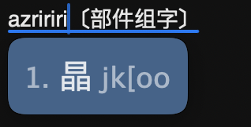
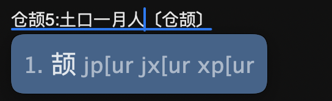

# 反查

对于不认识的字，支持仓颉、部件组字、两分、笔画、墨奇形码输入，反查双拼辅助码。

部件组字

<figure><figcaption></figcaption></figure>

仓颉反查

<figure><figcaption></figcaption></figure>

墨奇码反查

<figure><figcaption></figcaption></figure>

笔画hspnz 横竖撇捺折

<figure><figcaption></figcaption></figure>
