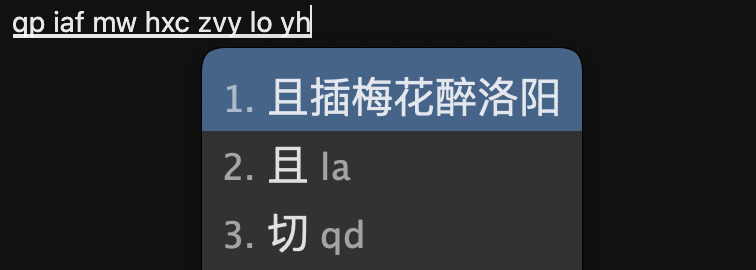

# 墨奇音形说明

墨奇音形支持多种双拼和多种形辅的组合，例如目前支持小鹤双拼+墨奇码，小鹤双拼+鹤形，自然码双拼+自然码辅助码，微软双拼+墨奇码，搜狗双拼+墨奇码等等。未来计划支持更多任意双拼+更多任意形辅的随意自由排列组合，例如大牛双拼+墨奇码，自然码双拼+鹤形，乱序双拼+五笔，拼音加加+虎码，智能ABC双拼+汉心码，紫光双拼+简单形等。

墨奇音形的取码规则是每个字4码，前2码为双拼部分，后2码为形辅部分。

例如：

“辅”字，双拼部分为fu，形辅部分则是if（车ie、甫fu的声母，墨奇码、自然码、鹤形这个字的辅助码恰好都是if）

“助”字，双拼部分为vu，形辅部分则是ql（且q 力l的声母）

墨奇音形是一个整句、字词兼备的方案，即使不用辅助码，也有不亚于搜狗、手心关闭云输入时的效果。

<figure><figcaption></figcaption></figure>

<figure><figcaption></figcaption></figure>

使用辅助码的效果：

支持句中任意一个字上加辅码

<figure><figcaption></figcaption></figure>

<figure><figcaption></figcaption></figure>

<figure><figcaption></figcaption></figure>
