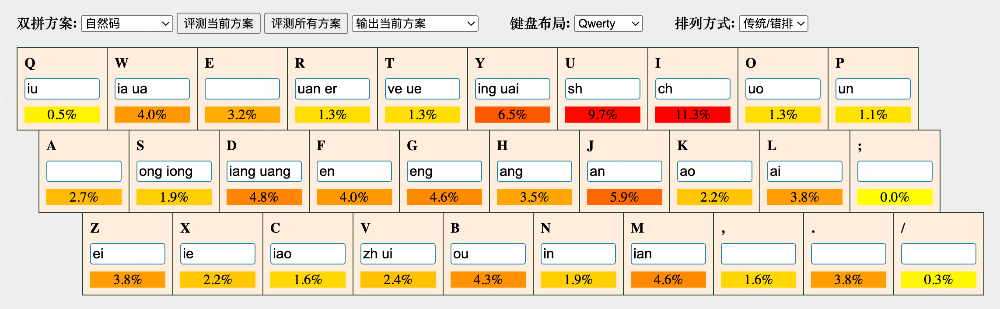

# 双拼说明

推荐一个双拼方案评测网站：[https://macroxue.github.io/shuangpin/eval.html](https://macroxue.github.io/shuangpin/eval.html)

按作者自己的学习经历来说，双拼部分比较容易上手，一般坚持用一周左右，纯双拼打字速度就能到40字/分钟。使用双拼之前先背5分钟，不要依赖双拼键位皮肤什么的，用的时候用脑回想键位，如果还记不住可以睡前在脑内回想键位图助眠。坚持下去即可。作者本人换过3种双拼。

<figure><figcaption></figcaption></figure>

<figure><figcaption></figcaption></figure>

<figure><figcaption></figcaption></figure>

